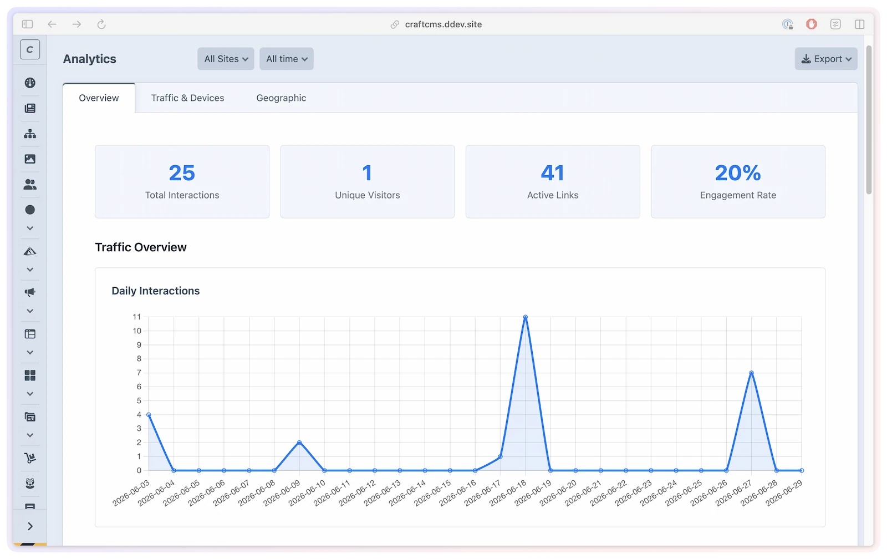

# Analytics

Know exactly who's clicking your short links — device, location, referrer, and trends — without sending data to an external service. ShortLink Manager tracks clicks inline on the same server that handles your redirects, so there's no third-party dependency and no extra latency.

## What you'll use it for

- Seeing which links drive the most traffic, filtered to any date range
- Identifying whether visitors arrive on desktop or mobile and where they're coming from geographically
- Comparing this week vs last week to measure campaign impact
- Counting unique visitors (not just raw clicks) with privacy-preserving IP hashing
- Exporting click data to CSV, Excel, or JSON for reporting

## The analytics dashboard

Go to **ShortLink Manager → Analytics**. Across the top sits a row of summary cards — **Total Interactions**, **Unique Visitors** (based on IP hashing — requires `ipHashSalt`), **Active Links**, and **Engagement Rate** — followed by tabs that group the detail.



### Overview

- **Daily Interactions** — time-series chart of activity over the selected date range
- **Top ShortLinks (Top 20)** — most-clicked links in the range (disabled links are excluded, even if they recorded clicks while enabled)
- **Interactions (Last 20)** — the most recent individual clicks

### Traffic & Devices

- **Device Types** — Desktop / Tablet / Mobile split
- **Traffic Type** — human, system, and bot traffic split
- **Top Agents** — known bots and first-party system agents such as cache warmers
- **Device Brands** — most common device manufacturers
- **Operating Systems** — OS share, parsed from the user-agent
- **Browser Usage** — browser share, parsed from the user-agent
- **Peak Usage Hours** — when clicks happen across the day

### Geographic

Shown only when geolocation is enabled (`enableGeoDetection`):

- **Top Countries** — most common visitor countries
- **Top Cities** — most common visitor cities

**Date range options:** Today, Yesterday, This week, Last week, Last 7 days, Last 14 days, Last 30 days, Last 90 days, This month, Last month, This quarter, Last quarter, This year, Last year, Last 12 months, All time.

Analytics can be exported to CSV, Excel, or JSON from the export button (requires `shortLinkManager:exportAnalytics` permission). Exports include device brand/model, browser version and engine, detected language, traffic type, system-agent flag, bot flag, bot name, bot category, and bot producer when those values are available.

## What gets tracked

Every click records:

- **Short link** — which link was clicked
- **Timestamp** — exact date and time
- **Device type** — Desktop, Tablet, or Mobile, detected from the user-agent string
- **OS / Browser** — parsed from the user-agent
- **Detected language** — detected language code from request/browser fallback logic
- **Traffic type and agent** — whether the click was human, system, or bot traffic, with bot/system-agent metadata when detected
- **Referrer** — the page the visitor came from (if the browser sends it)
- **Country and City** — from IP geolocation (if `enableGeoDetection` is enabled)
- **IP Hash** — a privacy-preserving one-way hash of the visitor's IP for unique visitor counting; requires `ipHashSalt` to be set

> [!NOTE]
> Clicks where `trackAnalytics` is `false` on the short link are not recorded. QR code scans are tracked the same as regular clicks (since the QR code redirects through the same short URL).

## Enabling analytics

Analytics is enabled by default (`enableAnalytics = true`). Disable it globally if you don't need tracking:

```php
// config/shortlink-manager.php
return [
    '*' => [
        'enableAnalytics' => false,
    ],
];
```

Individual links can have tracking disabled via the **Track Analytics** toggle on the link edit screen.

## Unique visitor tracking

ShortLink Manager counts unique visitors by hashing each visitor's IP address with a secret salt. This lets you see how many different people clicked a link, without storing raw IP addresses.

**To enable unique visitor tracking:**

1. Generate a salt:

```bash title="PHP"
php craft shortlink-manager/security/generate-salt
```

```bash title="DDEV"
ddev craft shortlink-manager/security/generate-salt
```

2. This writes `SHORTLINK_MANAGER_IP_SALT` to your `.env` file.

> [!IMPORTANT]
> Use the same salt across all environments (dev, staging, production). Changing the salt resets unique visitor counts — existing click records retain their old hashes.

## IP anonymization

For stricter privacy compliance, enable subnet masking before hashing:

```php
return [
    '*' => [
        'anonymizeIpAddress' => true, // e.g. 192.168.1.123 → 192.168.1.0
    ],
];
```

This replaces the last octet of IPv4 addresses with `0` before hashing. The resulting hash is still consistent across clicks from the same subnet, so unique visitor counting still works at the subnet level.

## Geolocation

Geolocation maps IP addresses to countries and cities. It runs inline during the analytics write path, using the same normalized IP state as hashing. If IP hashing cannot run because the salt is missing, geo lookup is skipped too.

```php
return [
    '*' => [
        'enableGeoDetection' => true,
        'geoProvider' => 'ip-api.com', // or 'ipapi.co', 'ipinfo.io'
        'geoApiKey' => \craft\helpers\App::env('SHORTLINK_MANAGER_GEO_API_KEY'), // for paid tiers
    ],
];
```

**Available providers:**

| Provider | Free tier | HTTPS |
|----------|-----------|-------|
| `ip-api.com` | Yes (45 req/min) | Paid only |
| `ipapi.co` | Yes (1,000 req/day) | Yes |
| `ipinfo.io` | Yes (50,000 req/month) | Yes |

> [!TIP]
> For local development, private IP addresses (127.0.0.1, 192.168.x.x) cannot be geolocated automatically. Set both defaults to record a local test location:
> ```php
> 'defaultCountry' => 'US',
> 'defaultCity' => 'New York',
> ```
> Or use the `SHORTLINK_MANAGER_DEFAULT_COUNTRY` and `SHORTLINK_MANAGER_DEFAULT_CITY` env vars. If either value is missing or unsupported, local/private IP geo fields stay empty.

## Data retention

Analytics data is automatically cleaned up after the configured retention period:

```php
return [
    '*' => [
        'analyticsRetention' => 90, // days, 0 = keep forever
    ],
];
```

The cleanup runs as a self-rescheduling queue job every 24 hours. It schedules itself when the plugin initializes (if no existing cleanup job is queued).

You can manually trigger cleanup from **ShortLink Manager → Settings → Cleanup Analytics** in the CP, or clear all analytics data from **Utilities → ShortLink Manager** (requires `shortLinkManager:clearAnalytics` permission).

## Device detection cache

Parsing user-agent strings is CPU-intensive. ShortLink Manager caches parsed device detection results:

```php
return [
    '*' => [
        'cacheDeviceDetection' => true,
        'deviceDetectionCacheDuration' => 3600, // 1 hour
    ],
];
```

In development, you may want to disable this cache to avoid stale results during testing:

```php
'dev' => [
    'cacheDeviceDetection' => false,
],
```

## Dashboard widgets

Two Craft dashboard widgets provide at-a-glance analytics. Add them via **Dashboard → New Widget**.


**ShortLink Manager - Analytics** shows click totals, unique visitors, top links, and device breakdown for a configurable date range (default: last 7 days).

**ShortLink Manager - Top Links** shows the most-clicked links for a configurable date range, with configurable limit (1–20 links, default 5).

Both widgets require `shortLinkManager:viewAnalytics` permission.

---

The sections below are for developers who need to access analytics data in templates or build custom reporting.

## Analytics in Twig

Access analytics for a specific link from Twig:

```twig



    {# Get click stats via the template variable #}
    

    {# Or directly from the link element #}
    

    <p>Total clicks: {{ link.hits }}</p>

```

The `getAnalytics()` method accepts a `filters` array for date filtering. See [Template Variables](../developers/template-variables.md) for details.
