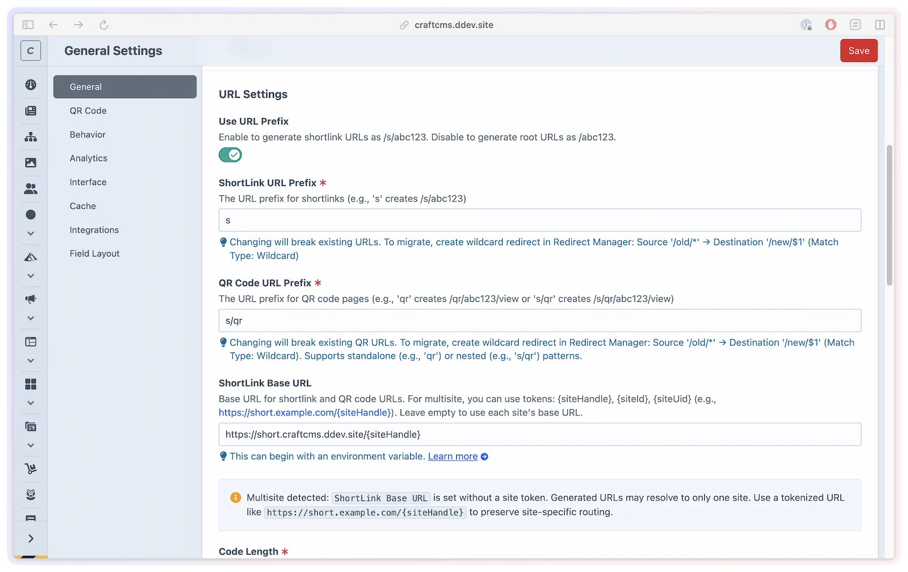

# Custom domain

Serve your short links from a branded domain — `short.example.com` instead of your main site's URL — with a single config setting. No separate Craft site is required; your existing installation handles the routing.

## What you'll use it for

- Branding short links with a dedicated domain (e.g., `short.example.com/s/abc123`)
- Giving each Craft site in a multisite its own URL path segment
- Keeping dev/local environments on the default site URL while production uses the custom domain

## Setting your custom domain

Add `shortlinkBaseUrl` to your config file and set the value via an environment variable:

```php
// config/shortlink-manager.php
use craft\helpers\App;

return [
    '*' => [
        'shortlinkBaseUrl' => App::env('SHORTLINK_BASE_URL'),
    ],
];
```

```bash
# .env
SHORTLINK_BASE_URL=https://short.example.com
```

With this configuration, a link with code `abc123` generates URLs like:

```
https://short.example.com/s/abc123
https://short.example.com/qr/abc123
```

The link path uses `slugPrefix` (default `s`) and the QR path uses `qrPrefix` (default empty, which falls back to `qr`) — the two prefixes are independent.

This overrides the site's own base URL when generating shortlink URLs, but does **not** require a separate Craft site. Your existing Craft site handles the routing — `shortlinkBaseUrl` only changes what URL is displayed and encoded in QR codes.



> [!TIP]
> Rule of thumb: Single-site → `shortlinkBaseUrl` as a plain URL. Multisite where each site needs its own path → `shortlinkBaseUrl` with a `{siteHandle}` token.

## Multisite site-aware URLs

For a Craft multisite where each site needs its own URL path segment, include a site token in the `.env` value:

```bash
# .env
SHORTLINK_BASE_URL=https://short.example.com/{siteHandle}
```

**Supported tokens:**

| Token | Replaced with |
|-------|--------------|
| `{siteHandle}` | The site's handle (e.g., `en`, `de`) |
| `{siteId}` | The site's numeric ID |
| `{siteUid}` | The site's UID |

With `https://short.example.com/{siteHandle}`, links generate URLs like:

- English site: `https://short.example.com/en/s/abc123`
- German site: `https://short.example.com/de/s/abc123`

## Site-aware routes

ShortLink Manager always registers site-aware routes (carrying a `{siteHandle}` segment) alongside the standard routes — they don't depend on `shortlinkBaseUrl`. They let the redirect controller resolve which Craft site to look the short link up in when a `{siteHandle}` is present in the URL path (for example when `shortlinkBaseUrl` includes the `{siteHandle}` token):

| Route | Controller |
|-------|-----------|
| `/{slugPrefix}/{code}` | Redirect controller |
| `/{siteHandle}/{slugPrefix}/{code}` | Redirect controller (site-aware) |
| `/{qrPrefix}/{code}` | QR code image |
| `/{siteHandle}/{qrPrefix}/{code}` | QR code image (site-aware) |
| `/{qrPrefix}/{code}/view` | QR display page |
| `/{siteHandle}/{qrPrefix}/{code}/view` | QR display page (site-aware) |

## How URLs are built

The `Settings::buildPublicUrl()` method resolves the correct base URL in this order:

1. If `shortlinkBaseUrl` is set and non-empty — expand supported site tokens and use as base
2. Else — use `UrlHelper::siteUrl()` with the short link's `siteId`

This method is called when generating `ShortLink::getUrl()`, `getQrCodeUrl()`, and `getQrCodeDisplayUrl()`. The two QR helpers return canonical public paths; styling options do not create alternate public URLs.

## Server configuration

Your web server must point `short.example.com` to your Craft installation. The plugin handles routing internally — no additional server config beyond a standard Craft vhost is needed.

If you use a true separate domain (not a subdomain of your main site), ensure:

- The domain resolves to the same server as your Craft installation
- Your server vhost serves Craft from that domain
- SSL is configured for the domain

## Validation

`shortlinkBaseUrl` must be a valid URL starting with `http://` or `https://`.

If `{...}` tokens are used in `shortlinkBaseUrl`, only `{siteHandle}`, `{siteId}`, and `{siteUid}` are supported. Using `{siteName}` or any other unsupported token triggers a validation error.

## Multi-environment example

```php
// config/shortlink-manager.php
use craft\helpers\App;

return [
    '*' => [
        // Use a custom domain in production
        'shortlinkBaseUrl' => App::env('SHORTLINK_BASE_URL'),
    ],

    'dev' => [
        // On local dev, use the default site URL (no override needed)
        'shortlinkBaseUrl' => null,
    ],
];
```
