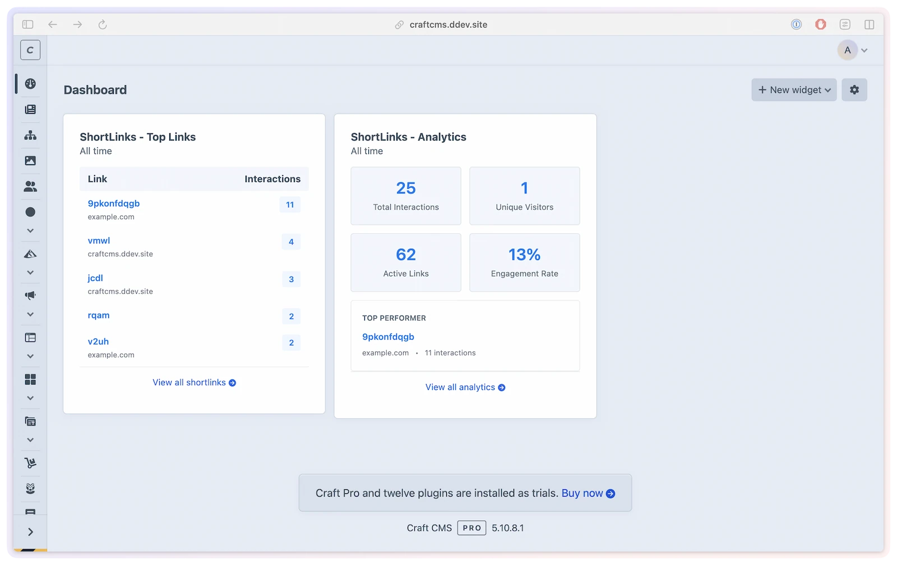

# Dashboard widgets

Keep an eye on short link performance without leaving the Craft dashboard. ShortLink Manager adds two widgets that surface click data at a glance — no need to open the analytics section for a quick status check.

## What you'll use them for

- Spot a sudden drop (or spike) in clicks first thing in the morning
- See which link is your current top performer while editing other content
- Share a focused view of link activity with team members who don't need the full analytics section
- Monitor a time-limited campaign link across different date windows

## Adding widgets

Go to **Dashboard → New Widget** and choose either widget from the ShortLink Manager section. Both widgets require the `shortLinkManager:viewAnalytics` permission to show data — without it, users see a "You don't have permission to view analytics" message instead.

Admins always have access regardless of permission settings.

## Analytics Summary widget

Get a four-stat snapshot of click activity for your links over a configurable time period.

### What it shows

- **Total interactions** — all recorded click events in the selected date range
- **Unique visitors** — distinct visitors in the period
- **Active links** — links with at least one click in the period
- **Engagement rate** — percentage of links that received clicks
- **Top performer** — the single highest-traffic link with its code and destination domain

### Configuration

Click the widget's settings icon to configure:

| Setting | Type | Default | Description |
|---------|------|---------|-------------|
| `dateRange` | `string` | `'last7days'` | Time period to summarize. Any of the 16 standard date ranges: `today`, `yesterday`, `thisWeek`, `lastWeek`, `last7days`, `last14days`, `last30days`, `last90days`, `thisMonth`, `lastMonth`, `thisQuarter`, `lastQuarter`, `thisYear`, `lastYear`, `last12months`, `all` |
| `siteId` | `string` | `All Sites` | Site scope for the summary. `All Sites` includes the plugin-enabled sites available to the current user. |

### When analytics are disabled

If analytics tracking is off in plugin settings, the widget shows "Analytics are disabled in plugin settings" instead of stats.

### Multi-site

Choose **All Sites** for a cross-site summary or select one site for a focused dashboard view. The site options follow ShortLink Manager's enabled-site configuration and the current user's site access.

## Top Links widget

See a ranked list of your most-clicked short links for the selected period.

### What it shows

- **Short code** — the link's code, linked to its edit page in ShortLink Manager
- **Destination domain** — abbreviated domain of the target URL (shown as plain text rather than a link if the stored URL fails the plugin's URL safety check)
- **Interactions** — total click count for the period

Disabled short links are excluded from the ranking, even if they recorded clicks while enabled.

### Configuration

Click the widget's settings icon to configure:

| Setting | Type | Default | Description |
|---------|------|---------|-------------|
| `dateRange` | `string` | `'last7days'` | Time period. Any of the 16 standard date ranges: `today`, `yesterday`, `thisWeek`, `lastWeek`, `last7days`, `last14days`, `last30days`, `last90days`, `thisMonth`, `lastMonth`, `thisQuarter`, `lastQuarter`, `thisYear`, `lastYear`, `last12months`, `all` |
| `siteId` | `string` | `All Sites` | Site scope for the ranked list. `All Sites` includes the plugin-enabled sites available to the current user. |
| `limit` | `int` | `5` | Maximum number of links to display (1–20) |

### When analytics are disabled

If analytics tracking is off in plugin settings, the widget shows "Analytics are disabled in plugin settings" instead of data.

### Multi-site

Like the Analytics Summary widget, Top Links can show **All Sites** or one selected site.

## Permissions

Both widgets require the `shortLinkManager:viewAnalytics` permission. See [Permissions](../developers/permissions.md) for the full permission reference.
