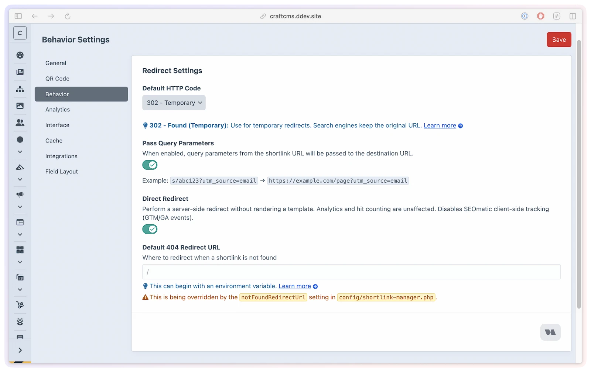

# Direct Redirect @since(5.12.0)

Skip the redirect template entirely and get a faster, server-side HTTP redirect. Use it globally for speed, then keep selected links on the template path when they need client-side tracking.

By default, ShortLink Manager renders a redirect template before issuing the final HTTP redirect. With the integration enabled, the template records selected QR-attributed arrivals and emits the selected redirect event when automatic onward navigation begins. Direct Redirect bypasses that template for a leaner, lower-latency response.

## What you'll use it for

- Maximum redirect speed when you don't need client-side tracking events
- Programmatic or API-driven short links where no browser template is needed
- Mixing tracking and non-tracking links in the same install — keep the template for campaign links, enable Direct Redirect for utility links
- Reducing latency caused by template asset loading or complex layouts on the redirect page



## Turning it on

### In the Control Panel

Go to **ShortLink Manager → Settings → Redirect Behavior → Direct Redirect** and enable the toggle.

### In a config file

```php
// config/shortlink-manager.php
return [
    '*' => [
        'directRedirect' => true,
    ],
];
```

The global setting (`bool`, default `false`) applies to every short link that hasn't been individually overridden.

## Per-link behavior

When global Direct Redirect is enabled, each short link shows its own **Direct Redirect** toggle on the edit screen. Turn it off for links that should keep rendering the redirect template, for example campaign links that need SEOmatic/GTM tracking.

The stored `directRedirect` value supports three states, which also matters for imports, GraphQL, and API-style element saves:

| Value | Behavior |
|-------|---------|
| `null` | Use the global setting (default) |
| `true` | Use direct redirect only when the global switch is enabled |
| `false` | Always use the redirect template for this link |

The global switch is the master switch: when it is off, even a saved per-link `true` renders the template. This lets you run Direct Redirect globally while keeping the template for specific links that need client-side tracking or custom redirect-page behavior.

## How it works

**Without Direct Redirect (default):**

1. Browser requests a short URL (e.g. `https://example.com/s/abc123`)
2. ShortLink Manager loads the redirect template (`shortlink-manager/redirect`)
3. The landing helper records `qr_scan` only for a browser `src=qr` arrival when that event is selected
4. After 100 ms, the navigation helper emits the selected `redirect` event. If a selected redirect or QR-arrival event was queued, it waits a further two seconds for asynchronous tracking, then forwards to an internal uncached action route; otherwise it forwards immediately
5. That action records enabled analytics, increments hits, and issues the final HTTP redirect to the destination

The two-second grace period does not guarantee analytics delivery. Direct HTTP mode has no browser tracking grace period.

An allowed `?debug=1` pauses steps 4–5, so a normal paused visit emits neither browser event and a QR-attributed paused visit can emit only `qr_scan`.

**With Direct Redirect:**

1. Browser requests a short URL (e.g. `https://example.com/s/abc123`)
2. ShortLink Manager records enabled internal analytics, increments hits, and issues a direct HTTP `301`/`302`/`307`/`308` response
3. Browser follows the redirect immediately

In Direct Redirect mode, server-side analytics only record when the short URL request actually reaches Craft. If a browser, CDN, or static cache serves the short URL before PHP runs, repeat-hit tracking can be bypassed.

## Caching behavior

Direct Redirect changes where tracking happens:

- `directRedirect = false`: the redirect template renders first, then sends the browser to an internal action route that performs analytics and the final redirect
- `directRedirect = true`: tracking and redirect happen on the original short URL request itself

This matters under caching:

- With `directRedirect = false`, the redirect page can still work with static caching because the tracked redirect happens on the internal action route
- With `directRedirect = true`, repeat-hit analytics depend on the short URL request reaching Craft every time

If your host, CDN, or static cache stores the short URL response, Direct Redirect can appear to "work once" and then stop recording until caches expire or are cleared.

> [!IMPORTANT]
> Direct Redirect is a performance feature, not a cache bypass. If you need reliable per-hit server-side analytics in direct mode, configure your infrastructure to bypass cache for your [shortlink routes](custom-domain.md#site-aware-routes).

> [!NOTE]
> When global analytics and the link's Track Analytics toggle are enabled, the direct redirect response is sent with `Cache-Control: no-store, no-cache, must-revalidate, max-age=0`, but some CDNs/edge caches cache redirects anyway — `301`/`308` most aggressively, because they're permanent. For analytics-heavy links prefer `302`/`307`, and in direct mode still add explicit cache-bypass rules for the short-link routes rather than relying on the `no-store` header alone. To check whether a CDN is serving a cached redirect (e.g. on staging, where `?debug=1` is unavailable), inspect the response headers for `x-cache: HIT` / a non-zero `age` — see [Troubleshooting](../resources/troubleshooting.md#diagnosing-on-staging-or-production-no-devmode).

## Impact on SEOmatic integration

> [!WARNING]
> SEOmatic client-side tracking events cannot fire when Direct Redirect is enabled. The redirect template is never rendered, so no JavaScript runs before the browser navigates away.

If you rely on SEOmatic/GTM tracking:
- Keep `directRedirect` globally set to `false`
- Use Direct Redirect only on links where tracking is not needed
- Or enable Direct Redirect globally and turn it off on specific links that still need tracking

See [Integrations](integrations.md) for SEOmatic configuration.

## When to use Direct Redirect

**Use Direct Redirect when:**
- Maximum redirect speed is critical
- You don't use GTM/GA tracking events via SEOmatic
- You understand that cache layers may reduce repeat-hit analytics unless those [routes](custom-domain.md#site-aware-routes) bypass cache
- The redirect template adds unnecessary latency (e.g., loading assets, complex layouts)
- You're using the short links programmatically and don't need a template at all

**Keep the redirect template when:**
- You fire SEOmatic/GTM tracking events before navigation
- You need analytics to remain reliable under static/browser/CDN caching
- Your redirect template includes analytics pixels or custom JS
- You need full control over the user experience during the redirect

## A minimal template with tracking

Keep a lightweight redirect page by rendering the two helpers without additional assets:

```twig
{{ shortLink.renderRedirectSeomaticTracking() }}
{{ shortLink.renderRedirectScript() }}
```

Render the tracking helper first. The navigation helper keeps the tracked `goUrl` hop and the redirect-event timing together. A meta refresh or custom navigation does not invoke that automatic event. See [Custom templates](../developers/custom-templates.md) for a complete page and a manual fallback link.

## Changing redirect modes or status codes

After changing `directRedirect` or switching a link between `301`/`308` and `302`/`307`, clear any relevant browser, CDN, or static caches before testing again. Old permanent redirect responses can stay cached and make the new behavior look broken until those caches are cleared.

On Servd hosting, the automatic [Servd static cache purge](integrations.md#servd-static-cache) fires per short link — it does **not** run when you toggle the global Direct Redirect setting. After a global change, run **Utilities → ShortLink Manager → Servd Static Cache** to purge all short URL and QR landing pages at once (the Behavior settings screen reminds you of this too).
