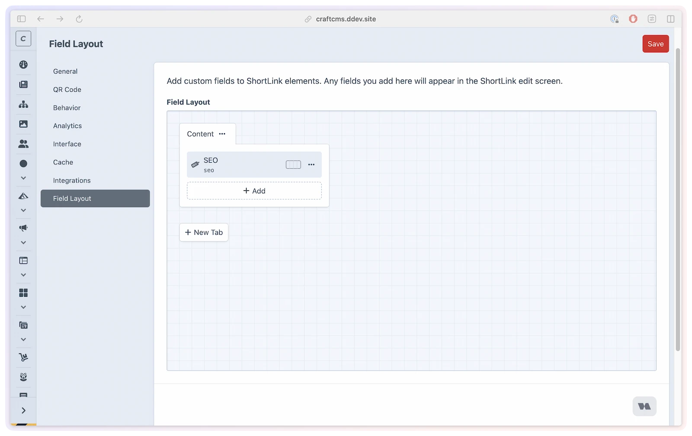

# Field layout

Add project-specific metadata directly to ShortLink elements, without building a separate entry section for link administration. Field layouts let editors manage the extra information your team needs beside each short link.

Use this when the short link itself needs fields like campaign owner, UTM plan, approval status, reporting notes, or production handoff details.

## What you'll use it for

- **Campaign metadata** — keep owner, channel, launch, and approval details beside the short URL.
- **UTM planning** — store tracking notes or review status next to the link that uses them.
- **Editorial workflow** — add internal fields for legal review, localization, or stakeholder sign-off.
- **Template output** — expose custom field values on the ShortLink element so your templates can render them where needed.

## Add fields to ShortLink elements

Go to **ShortLink Manager → Settings → Field Layout**.



Add any Craft fields you want ShortLink elements to carry. When a field-layout tab contains fields, it appears as an extra tab on the ShortLink edit screen.

Empty field-layout tabs are skipped on the edit screen, so a placeholder tab with no fields will not create an empty tab for editors.

## Field layout vs ShortLink Field

These two features solve different problems:

| Feature | Use it when |
|---------|-------------|
| **Field layout** | You want to add custom fields directly to ShortLink elements |
| **ShortLink Field** | You want entries or other elements to own or reference a short link |

If the data belongs to the short link itself, use the field layout. If another element needs its own managed short link, use the [ShortLink Field](shortlink-field.md).

## Project config behavior

Field layouts are Craft project-config changes. That means they should be changed in development and deployed through your normal project-config workflow.

When `allowAdminChanges` is disabled, the Field Layout settings page is read-only. The normal ShortLink Manager settings remain database-backed and editable from the CP unless a setting is locked by `config/shortlink-manager.php`.

## Template access

Custom fields are available on the ShortLink element like any other Craft element field:

```twig



    <p>Owner: {{ link.campaignOwner }}</p>

```

Use the handle you configured on the Craft field.

## Limitations

- Field-layout changes require an environment where Craft admin changes are allowed.
- Tabs without fields are not shown on ShortLink edit screens.
- This feature does not replace the ShortLink Field for entries and other elements.
