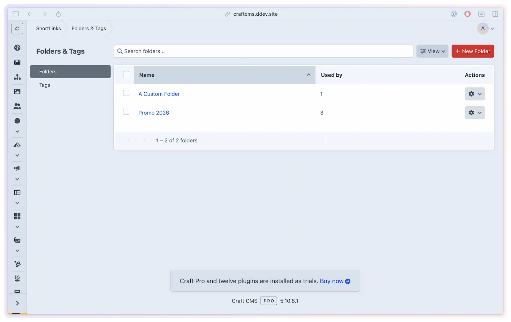

# Folders & tags

Keep your short link library organized as it grows. Folders let you group links into broad categories; tags let you apply multiple cross-cutting labels to any link. Both are managed directly in the ShortLink Manager CP — no Craft categories or native tag elements involved.

## What you'll use it for

- Grouping links by campaign, department, or project using folders
- Tagging links with audience, region, or content type for cross-cutting views
- Bulk-assigning or clearing folder/tag assignments across many links at once
- Filtering the short link index to a specific folder or tag
- Carrying folder and tag data through CSV export and re-import

## How it works

Folders and tags are separate taxonomies stored in the plugin's own database tables. They are independent of Craft's native Folder, Tag, or Category elements.

**Folders** provide a single-level grouping — one folder per link. Use them for broad organizational buckets: campaign, department, or project.

**Tags** allow multiple labels per link. Use them for cross-cutting attributes — audience, region, content type, or any other multi-value classification.

Both are managed from **ShortLink Manager → Folders & Tags**.

## Managing folders & tags

Navigate to **ShortLink Manager → Folders & Tags**. The section has a sidebar with two views:

- **Folders** — list of all folders with usage count (number of links in each folder)
- **Tags** — list of all tags with usage count

### Creating

Click **New Folder** or **New Tag** to create a new entry. Each requires a unique name. Names are normalized and converted to a slug automatically.

### Editing

Click a folder or tag name to open the edit form and rename it.

### Deleting

Use the row action menu to delete a single folder or tag. Deleting a folder also unassigns it from all linked short links. Deleting a tag removes it from the pivot table (all associations are cleared).

Select multiple rows and click **Delete (N)** to bulk delete.

## Assigning to short links

When creating or editing a short link, you can optionally assign:

- **Folder** — a single folder from a dropdown (populated from all existing folders)
- **Tags** — a comma-separated list of tag names; new tags are created automatically if they don't exist

Tags entered on the short link edit form are normalized and synced to the `shortlinkmanager_shortlink_tags` pivot table on save.

## Bulk actions on the short link index

The following bulk actions are available when selecting short links on the **Short Links** index:

| Action | Description |
|--------|-------------|
| **Add Tags** | Add one or more tags to all selected links (existing tags are preserved) |
| **Remove Tags** | Remove specific tags from all selected links |
| **Clear Tags** | Remove all tags from all selected links |
| **Set Folder** | Assign a folder to all selected links |
| **Clear Folder** | Remove the folder assignment from all selected links |

All bulk actions require the `shortLinkManager:editLinks` permission. **Set Folder** and **Add Tags** additionally require `shortLinkManager:createTaxonomy` when the folder or tag you enter doesn't exist yet, since they create it on the fly — assigning an existing folder or tag needs only `editLinks`.

On multi-site installs, bulk actions only apply to links on sites you have Craft's native "Edit site" permission for; selected links on other sites are skipped. See [Permissions → Multisite](../developers/permissions.md#multisite-the-native-editsite-permission).

## Filtering by folder or tag

The short link index supports filtering by folder and tag. Use the **Folder** or **Tag** source filters in the element index sidebar to narrow the list.

## CSV import & export

Folder and tag data is included in CSV export and import:

- **`folder`** column — the folder name (empty if unassigned)
- **`tags`** column — comma-separated tag names (empty if none)

On import, if a folder name does not exist it is created automatically. Tags listed in the CSV are also created if they don't already exist.

See [Import & Export](import-export.md) for details on the CSV workflow.

## Permissions

Folder and tag management uses a dedicated permission group separate from short link permissions:

| Permission | Description |
|------------|-------------|
| **`shortLinkManager:manageTaxonomy`** | Access the Folders & Tags CP section |
| └─ `shortLinkManager:createTaxonomy` | Create folders and tags |
| └─ `shortLinkManager:editTaxonomy` | Rename folders and tags |
| └─ `shortLinkManager:deleteTaxonomy` | Delete folders and tags |

See [Permissions](../developers/permissions.md) for the full permission reference.
