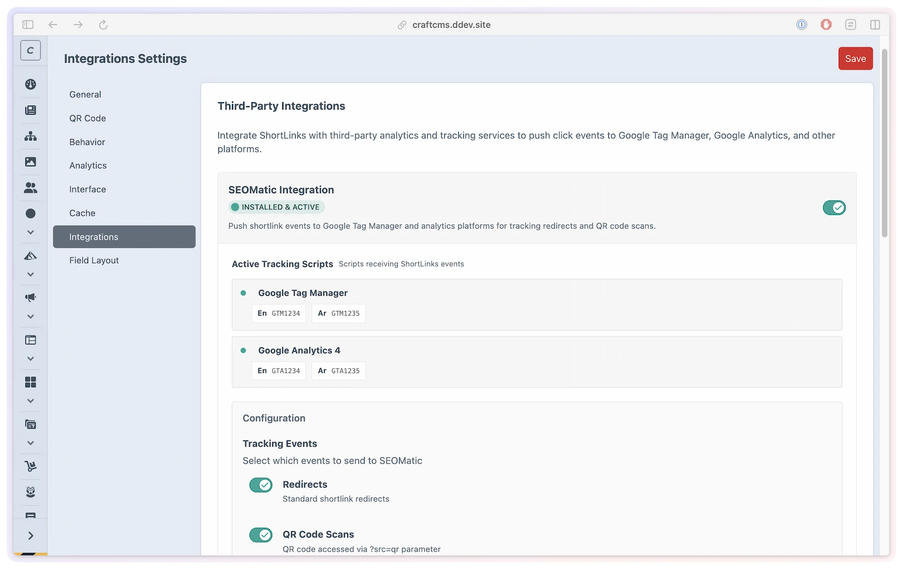

# Integrations

Connect ShortLink Manager to SEOmatic for GTM/GA4 tracking events, to Redirect Manager to preserve old slugs automatically, and to Craft's native Link field so editors can pick a short link anywhere a URL field appears.

ShortLink Manager integrates with SEOmatic, Redirect Manager, and Craft's native Link field. The SEOmatic and Redirect Manager integrations can be enabled or disabled in **Settings → Integrations**. The Craft Link Field integration registers automatically — no settings toggle required.

## What you'll use them for

- Record QR-attributed arrivals and automatic onward navigation from rendered shortlink pages in the data layer for your GTM/GA4 tags
- Automatically create a 301 redirect in Redirect Manager whenever a short link's slug changes, so existing bookmarks and QR codes keep working
- Let editors pick a short link as the target of any Craft Link field — in matrix blocks, global sets, or any other context where a URL is needed



## SEOmatic integration

When SEOmatic is installed and the integration is enabled, ShortLink Manager registers ShortLinks as a SEOmatic content source and initializes browser tracking on the rendered shortlink page. The helpers push structured events to `window.dataLayer`; your GTM/GA4 tags consume those events.

### Event types

Two event types are dispatched to the data layer. The `short_links` prefix shown below is the **default** — the event name is `{seomaticEventPrefix}_{eventType}`, so if you change the [`seomaticEventPrefix`](../get-started/configuration.md) setting the names use your prefix instead (e.g. `myprefix_redirect`).

| Event name (default prefix) | When it fires |
|------------|--------------|
| `short_links_redirect` | Immediately before automatic navigation from the rendered landing page to the tracked forwarding URL |
| `short_links_qr_scan` | The rendered shortlink landing page opens with `src=qr`, including a debug-paused visit |

The two event switches are independent. A QR-attributed visit normally emits `qr_scan` on arrival and `redirect` just before automatic navigation. Opening the QR image or display page emits neither. `src=qr` is attribution supplied in the URL, not proof that a camera scanned a code. A paused normal visit emits neither event; use your normal GA4 `page_view` for page views.

The `short_links` default applies to new installations. Existing saved or config-file prefixes, including `shortlink_manager`, stay unchanged. Match your GTM triggers to the effective Event Prefix value.

### Data layer structure

Tracking is pushed **client-side** at each event boundary. For example, automatic onward navigation produces this payload:

```json
{
    "event": "short_links_redirect",
    "shortlink": {
        "code": "abc123",
        "title": "My Campaign",
        "source": "direct",
        "click_type": "redirect"
    }
}
```

The `event` name is `{seomaticEventPrefix}_{eventType}` (e.g. `short_links_redirect` or `short_links_qr_scan`). `source` comes from the `src` query parameter on the short URL (defaults to `direct`), and `click_type` is the event type. Add your own device, geo, or campaign dimensions in GTM/GA4 from this event.

### Configuration

Enable the integration in **Settings → Integrations → SEOmatic**. The integration is automatically detected. (When SEOmatic isn't installed, see [Integration requirements](#integration-requirements) below for what the card shows.)

> [!WARNING]
> SEOmatic tracking events cannot fire when [Direct Redirect](direct-redirect.md) is enabled for a link. The redirect template is skipped, so no JavaScript runs before the browser navigates away. If you enable Direct Redirect globally, turn it off on links that still need SEOmatic/GTM tracking.

### Content SEO and sitemaps

When the integration is enabled, SEOmatic adds a **ShortLinks** source in **SEOmatic → Content SEO**. That source lets you manage the SEOmatic metadata bundle for rendered shortlink and QR pages, including title, robots, canonical URL, and sitemap settings.

ShortLink Manager sets conservative defaults:

| Setting | Default |
|---------|---------|
| SEO Title | From the ShortLink title |
| Canonical URL | The short link's public URL |
| Robots | `noindex,nofollow` |
| Sitemap URLs | Off |

If you enable sitemap URLs in SEOmatic, the generated sitemap URLs use the same public URL builder as short links and QR codes. That means `shortlinkBaseUrl`, custom domains, and multisite tokens such as `{siteHandle}`, `{siteId}`, and `{siteUid}` are respected.

SEOmatic only lists actual Craft field-layout fields as **Source Field** options. To manage SEO descriptions or images for short links, use one of these approaches:

- Add a SEOmatic SEO field to the ShortLink field layout and edit metadata per short link.
- Add your own text/asset fields to the ShortLink field layout, then map those fields in SEOmatic Content SEO.

Existing SEOmatic content bundles keep their saved settings. If you enabled the integration before changing defaults, resave or reset the ShortLinks source in SEOmatic to apply the current defaults.

### Using SEOmatic tracking helpers in templates

Render the landing helper before the navigation helper in your redirect template:

```twig
{{ shortLink.renderRedirectSeomaticTracking() }}
{{ shortLink.renderRedirectScript() }}
```

With analytics and the SEOmatic integration enabled, the landing helper initializes tracking and records QR arrival when applicable. The navigation helper waits 100 ms, emits the selected redirect event, and forwards through `goUrl`. An allowed `?debug=1` pauses navigation and its redirect event. Disabling either event does not disable navigation.

QR display templates need no tracking helper. Existing `renderQrSeomaticTracking()` and `renderSeomaticTracking('qr_scan')` calls remain valid and emit nothing. Use the Event Prefix setting to customize event names; see [Custom templates](../developers/custom-templates.md) for placement and debug behavior.

## Redirect Manager integration

When Redirect Manager is installed and the integration is enabled, ShortLink Manager automatically creates a 301 redirect whenever a short link's slug is changed.

### How it works

1. You edit a short link and change its slug from `my-campaign` to `my-campaign-v2`
2. ShortLink Manager detects the slug change on save
3. A 301 redirect is registered in Redirect Manager: `/s/my-campaign` → `/s/my-campaign-v2`
4. Any existing links or QR codes using the old slug continue to work

This prevents broken links when you need to rename or reorganize your short links.

### Configuration

Enable the integration in **Settings → Integrations → Redirect Manager**. The integration requires Redirect Manager to be installed.

> [!NOTE]
> The redirect is created using the `slugPrefix` setting. If you change the prefix, existing redirects created under the old prefix will still point to the old prefix path.

## Craft Link Field integration @since(5.2.0)

ShortLink Manager registers itself as a link type option for Craft's native [Link field](https://craftcms.com/docs/5.x/reference/field-types/link.html) (available in Craft CMS 5.3+).

Users can select a short link as the link target in any Link field — anywhere a URL, entry, category, or asset would normally appear. No settings toggle is required; the link type registers automatically when Link field is installed.

### Value format

When a Link field contains a ShortLink selection, the field value resolves to the short link's public redirect URL (`/{slugPrefix}/{slug}`), so it works transparently in templates:

```twig
{# In a matrix block with a Link field named 'ctaLink' #}
<a href="{{ block.ctaLink.url }}">{{ block.ctaLink.text }}</a>
```

If the short link is disabled or expired, the URL returns `null` — the same behavior as a disabled entry in a Link field.

### ShortLinkType

The `ShortLinkType` class is registered automatically when Link Field is installed. There is no additional configuration required.

## Servd static cache

When the [Servd Asset Storage](https://plugins.craftcms.com/servd-asset-storage) plugin is installed and enabled, ShortLink Manager automatically purges Servd's static cache for the affected URLs whenever a short link changes — there's no settings toggle to turn it on.

- **What's purged:** the public short URL and the QR landing URL, across all enabled sites (generated with `Settings::buildPublicUrl()`, so `shortlinkBaseUrl`, custom domains, and `{siteHandle}` tokens are respected).
- **When:** on save/update, before delete, after a slug change (the old slug is purged too), and when ShortLink Manager caches are cleared.
- **Prerequisites:** purging only runs on Servd's hosting infrastructure with static cache enabled — the PHP `redis` extension must be loaded, Servd's runtime environment variables (`SERVD_CACHE_ENABLED`, `REDIS_HOST`, `REDIS_PORT`, `REDIS_STATIC_CACHE_DB`, `SERVD_PROJECT_SLUG`) must be present, and `ENVIRONMENT` must be exactly `development`, `staging`, or `production`. On a standard Servd deployment these are already set; anywhere else the purge is silently skipped.

This keeps Servd from serving stale redirect/QR responses after a change. Two caveats:

- **Global settings changes don't auto-purge.** The automatic purge fires per short link (save, delete, slug change) — not when you flip a plugin-wide setting. After toggling the global [Direct Redirect](direct-redirect.md) setting, run **Utilities → ShortLink Manager → Servd Static Cache** so cached redirect responses are refreshed (the Behavior settings screen shows this reminder too).
- It does **not** replace cache-bypass rules for [Direct Redirect](direct-redirect.md) if every hit must reach Craft for analytics — see [Troubleshooting](../resources/troubleshooting.md#analytics-record-once-then-stop-under-static-cache).

## Integration requirements

| Integration | Required plugin |
|-------------|----------------|
| SEOmatic | `nystudio107/craft-seomatic` |
| Redirect Manager | `lindemannrock/craft-redirect-manager` |
| Craft Link Field | Craft CMS 5.3+ (native Link field) |
| Servd static cache | `servd/craft-asset-storage` (optional — auto-detected; Servd hosting only) |

All integrations are detected automatically. If the required plugin is not installed, its card still shows with an **Install Plugin** link but the enable toggle is disabled, and no integration code runs until it is installed and enabled.

For the `IntegrationInterface` API reference, see [Integrations API](../developers/integrations.md).
