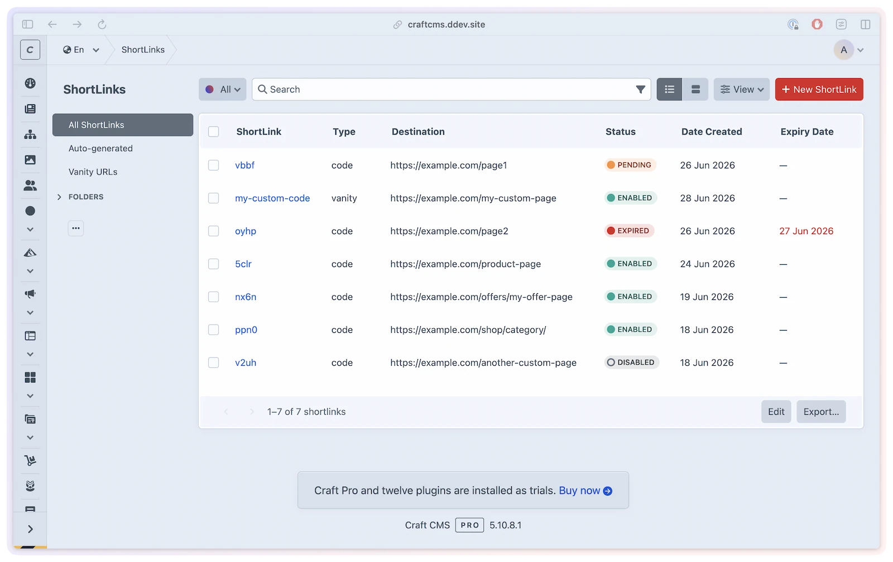

# Features overview

Turn any URL into a short, trackable link — and a scannable QR code — without leaving the Control Panel.

> [!TIP]
> New to ShortLink Manager? Start with [Installation](../get-started/installation.md), then come back here for a tour of the features.

## What you'll use it for

- **Campaign links** — create a short, memorable URL for each marketing channel and track which one drives the most clicks.
- **Print collateral** — every short link gets a QR code your audience can scan. Update the destination any time without reprinting.
- **Element-linked redirects** — attach a short link to an entry and its destination updates automatically when the entry slug changes.
- **Multi-site link management** — one short code, per-site destinations. Useful for regional or language variants of the same content.
- **Organized link libraries** — group links into folders and tag them for bulk operations across large link sets.

## What's in the box

- **[Short links](shortlinks.md)** — auto-generated codes (`/s/abc123XY`) or vanity URLs (`/s/summer-sale`). Per-link HTTP codes (301, 302, 307, 308), expiry dates, and post dates. Link to Craft elements or any URL.

- **[QR codes](qr-codes.md)** — every short link gets a canonical, cacheable QR code. Customize saved output, preview unsaved styling in the control panel, and export PNG or SVG up to 4096px.

- **[Analytics](analytics.md)** — click tracking with device detection (desktop, tablet, mobile), geolocation (country, city), referrer, and unique visitor counting via IP hashing. Dashboard widgets for at-a-glance stats.

- **[Custom domain](custom-domain.md)** — serve all short links from a dedicated domain (e.g., `https://short.example.com`) with site-aware URL patterns for multisite setups.

- **[Direct redirect](direct-redirect.md)** — bypass the redirect template for maximum performance. Server-side analytics and hit counting still run when the short URL request reaches Craft; SEOmatic/GTM events need the redirect template.

- **[ShortLink field](shortlink-field.md)** — a custom field type that attaches a short link to any element. The destination URL syncs automatically when the element URL changes.

- **[Field layout](field-layout.md)** — add fields to ShortLink elements when the link itself needs campaign metadata, UTM planning, ownership notes, approval details, or other editor-managed fields. Populated tabs render on the ShortLink edit screen.

- **[Integrations](integrations.md)** — SEOmatic pushes GTM/GA4 data layer events on redirect and QR scan. Redirect Manager auto-creates 301s when slugs change. Craft Link Field lets editors pick short links in any Link field.

- **Folders & tags** — organize short links using plugin-internal folders (one per link) and tags (many per link). Manage them at **ShortLink Manager → Folders & Tags**. Use bulk actions on the element index to assign or clear folders and tags across multiple links at once.

- **Import / export** — bulk-import short links from CSV via **ShortLink Manager → Import/Export**. Map columns in the browser before committing, then review a per-row preview (valid, duplicate, error) before importing. Export all short links to CSV at any time. Import history is logged for auditing.

## Dashboard widgets

ShortLink Manager registers two Craft dashboard widgets. Add them via **Dashboard → New Widget**.

| Widget | Description |
|--------|-------------|
| **ShortLink Manager - Analytics** | Total interactions, unique visitors, active links, and engagement rate for a configurable date range, plus the top-performing link |
| **ShortLink Manager - Top Links** | Most-clicked links for a date range. Configurable limit (1–20) |

Both widgets require the `shortLinkManager:viewAnalytics` permission and can be scoped to **All Sites** or one selected site.

## CP utility

ShortLink Manager adds a utility at **Utilities → ShortLink Manager** with system stats (total links, active, pending, expired) and maintenance actions (clear cache, cleanup analytics). The utility can show link and analytics stats for **All Sites** or one enabled site available to the current user; cache counts and Servd static-cache purge actions remain global.

## Element index

The main element index at **ShortLink Manager** lists each short link by its clickable code/title, with columns for Type, Destination, Status, Interactions, and Date Created. Filter by status, link type, or search by code or destination URL.

**Bulk actions:** Enable, Disable, Delete, Duplicate, Set Folder, Clear Folder, Add Tags, Remove Tags, Clear Tags.

**Link sources:** All Links, Auto-generated, Vanity URLs.

## Multi-site support

Short links are localized. Each site can have its own destination URL for the same short code, which is especially useful with the ShortLink Field — when an entry is saved, each site's destination URL is resolved from that site's entry URL automatically.

The `enabledSites` setting controls which sites have short link support. An empty array enables all sites.

## Next steps

1. [Install the plugin](../get-started/installation.md)
2. [Configure it](../get-started/configuration.md)
3. [Create your first short link](shortlinks.md)
4. [Set up QR codes](qr-codes.md)
5. [Enable analytics](analytics.md)
