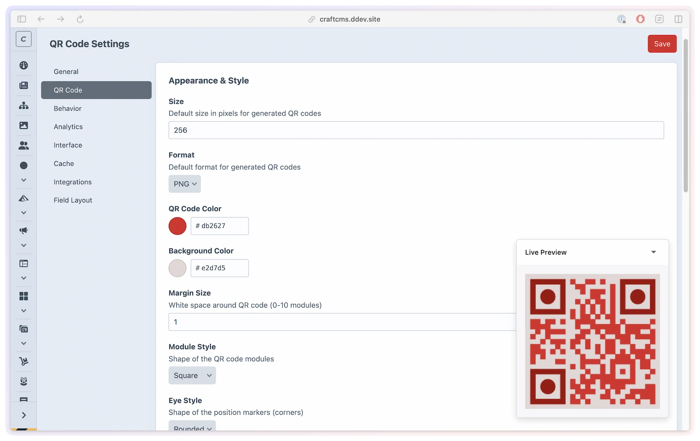
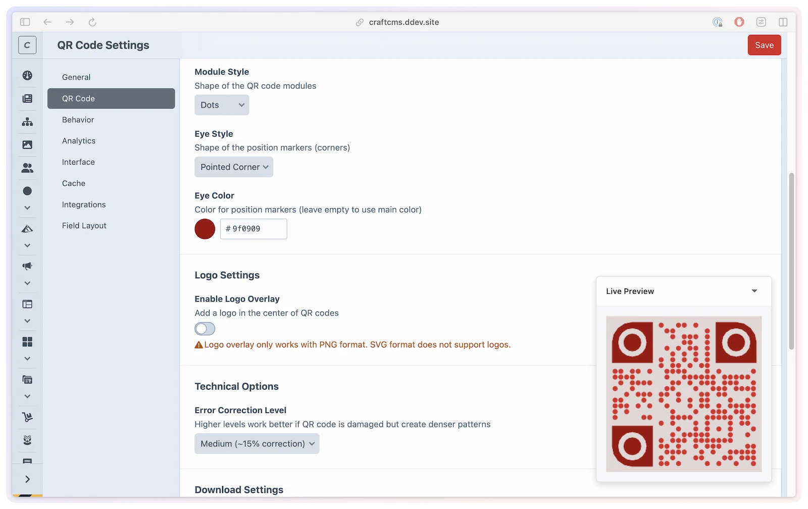

# QR codes

Every short link comes with a scannable QR code — no extra setup. Because the QR code encodes the short URL (not the destination), you can update where a link points any time without reprinting.

## What you'll use it for

- **Print campaigns** — place a QR code on a flyer, poster, or business card that still works after you update the destination.
- **Branded scannables** — add your logo to the center of a QR code and match colors to your brand palette.
- **Flexible delivery** — embed QR codes directly in Twig templates as data URIs (useful for email), or link to the hosted image endpoint.
- **Bulk downloads** — generate and download QR codes as PNG or SVG for use in design assets.

## Turn on and customize QR codes

### Enable per link

On the short link edit page, toggle **QR Code Enabled** to activate the QR endpoints for that link. When disabled, both the image and display-page endpoints return a 404.

### Set global defaults

Go to **Settings → QR Codes** to configure appearance defaults for all links. A live preview updates as you change the size, colors, and styles, so you can see the result before saving — the same preview also appears on a short link's edit page when you override QR settings per link.



Per-link values left at `null` inherit from these global defaults.

### Choose a visual style

Module style and eye style combine to give your QR codes a distinct look:



| Option | Values | Default |
|--------|--------|---------|
| Module style | `'square'`, `'dots'`, `'rounded'` | `'square'` |
| Eye style | `'square'`, `'rounded'`, `'pointed'` | `'square'` |

> [!WARNING]
> The `dots` module style may not scan reliably at very small sizes. Use at least 200 px when choosing `dots`.

---

## Customization reference

### Appearance settings

| Setting | Type | Default | Description |
|--------|------|---------|-------------|
| `defaultQrSize` | `int` | `256` | Output size in pixels (100–1000) |
| `defaultQrColor` | `string` | `'#000000'` | Module foreground color (hex) |
| `defaultQrBgColor` | `string` | `'#FFFFFF'` | Background color (hex) |
| `defaultQrFormat` | `string` | `'png'` | Output format: `'png'` or `'svg'` |
| `defaultQrMargin` | `int` | `4` | Quiet zone in modules (0–10) |
| `defaultQrErrorCorrection` | `string` | `'M'` | Error correction: `'L'` (7%), `'M'` (15%), `'Q'` (25%), `'H'` (30%) |
| `qrModuleStyle` | `string` | `'square'` | Module shape: `'square'`, `'dots'`, `'rounded'` |
| `qrEyeStyle` | `string` | `'square'` | Finder pattern shape: `'square'`, `'rounded'`, `'pointed'` |
| `qrEyeColor` | `?string` | `null` | Eye color override (hex). Falls back to foreground color |

### Logo overlay

Enable `enableQrLogo` in settings to add a brand logo to the center of QR codes. When enabled:

- Set a **default logo** (a Craft asset) applied to all QR codes unless overridden per link.
- Optionally restrict which asset volume logos can come from (`qrLogoVolumeUid`).
- Control the **logo size** as a percentage of the QR code width (10–30%, default 20%).

Per-link logo overrides use the `qrLogoId` field on the short link edit page.

| Setting | Type | Default | Description |
|---------|------|---------|-------------|
| `enableQrLogo` | `bool` | `false` | Enable logo overlay |
| `qrLogoVolumeUid` | `?string` | `null` | Restrict logo selection to this asset volume |
| `defaultQrLogoId` | `?int` | `null` | Default logo asset ID |
| `qrLogoSize` | `int` | `20` | Logo size as percentage of QR code (10–30) |

> [!WARNING]
> A logo reduces the scannable area. Use `defaultQrErrorCorrection: 'H'` (30% recovery) when adding a logo to ensure reliable scanning.

## QR code URLs

When QR code generation is enabled on a short link, two endpoints become available:

| URL | Returns |
|-----|---------|
| `/{qrPrefix}/{code}` | Raw QR code image (PNG or SVG) |
| `/{qrPrefix}/{code}/view` | Display page with title, image, and download button |

With a common configuration (`qrPrefix` = `s/qr`):

- Image: `https://example.com/s/qr/abc123`
- Display page: `https://example.com/s/qr/abc123/view`

The QR image URL accepts query parameters to customize on the fly:

| Parameter | Example | Description |
|-----------|---------|-------------|
| `size` | `?size=512` | QR code size in pixels |
| `color` | `?color=ff0000` | Foreground color (hex without `#`) |
| `bg` | `?bg=ffffff` | Background color (hex without `#`) |
| `format` | `?format=svg` | Output format |
| `margin` | `?margin=2` | Quiet zone modules |
| `moduleStyle` | `?moduleStyle=dots` | Module shape |
| `eyeStyle` | `?eyeStyle=rounded` | Eye shape |
| `eyeColor` | `?eyeColor=0000ff` | Eye color override |
| `download` | `?download=1` | Trigger file download instead of inline display |

Color parameters are forgiving: a value that isn't a valid 6-digit hex color (`color`, `bg`, or `eyeColor`) is silently ignored and the configured default is used instead — the QR code always renders rather than erroring.

## Downloading QR codes

When `enableQrDownload` is `true` (default), QR codes can be downloaded. The download filename follows the `qrDownloadFilename` pattern with these tokens:

| Token | Replaced with |
|-------|--------------|
| `{code}` | The short link's code |
| `{size}` | The QR code size in pixels |
| `{format}` | The format: `png` or `svg` |

Default pattern: `{code}-qr-{size}` produces filenames like `abc123-qr-256.png`.

---

## Using QR codes in templates

The `ShortLink` element provides methods for embedding QR codes in Twig templates:

```twig



    {# Inline data URI — embed directly in  #}
    

    {# URL to the raw QR image #}
    

    {# Link to the QR display page #}
    <a href="{{ link.qrCodeDisplayUrl }}">View QR Code</a>

    {# Custom options via method call #}
    

    {# Base64 data URI for email templates #}
    

```

| Method | Returns | Description |
|--------|---------|-------------|
| `getQrCodeUrl(options)` @since(5.0.0) | `string` | URL to the raw QR image — most efficient for web use |
| `getQrCodeDataUri(options)` @since(5.0.0) | `string` | Base64 `data:image/...` URI — use for email or inline embedding |
| `getQrCode(options)` @since(5.0.0) | `string` | Raw binary image data (for programmatic use) |
| `getQrCodeDisplayUrl(options)` @since(5.1.0) | `string` | URL to the `/view` display page |

All methods accept an `options` array with any of the customization options listed above. When called without arguments (or as properties like `link.qrCodeUrl`), global defaults are used.

## The display page

The `/{qrPrefix}/{code}/view` endpoint renders a styled page containing the QR code with context. A custom template can be set via the `qrTemplate` setting.

For the starter template, copy command, and available variables, see [Custom templates](../developers/custom-templates.md#qrtwig).

The following variables are available in the display template:

| Variable | Type | Description |
|----------|------|-------------|
| `shortLink` | `ShortLink` | The short link element |
| `siteName` | `string` | The current site's name |
| `currentSite` | `Site` | The current Craft site object |

## Caching

Generated QR codes are cached to avoid regenerating on every request.

| Setting | Default | Description |
|---------|---------|-------------|
| `enableQrCodeCache` | `true` | Enable QR code caching |
| `qrCodeCacheDuration` | `86400` | Cache TTL in seconds (24 hours) |
| `cacheStorageMethod` @since(5.3.0) | `'file'` | `'file'` (single server) or `'redis'` (multi-server) |

The cache key includes the URL and all rendering options, so changing any option automatically generates a fresh QR code. Cache can be cleared from **Utilities → ShortLink Manager** (requires `shortLinkManager:clearCache` permission).

```php
// config/shortlink-manager.php
return [
    'enableQrCodeCache'   => true,
    'qrCodeCacheDuration' => 86400,
    'cacheStorageMethod'  => 'file',
];
```

## Global vs per-link settings

Global QR defaults are set in **Settings → QR Codes**. Per-link overrides are set on the short link edit page. Any per-link option left `null` inherits from the global setting.

```php
// config/shortlink-manager.php
return [
    'defaultQrSize'             => 400,
    'defaultQrColor'            => '#1a1a2e',
    'defaultQrBgColor'          => '#FFFFFF',
    'defaultQrFormat'           => 'png',
    'qrModuleStyle'             => 'rounded',
    'qrEyeStyle'               => 'rounded',
    'qrEyeColor'               => null,
    'defaultQrMargin'           => 2,
    'defaultQrErrorCorrection'  => 'H',
];
```

> [!TIP]
> QR scans follow the same redirect mode as normal clicks. If `directRedirect` is enabled, repeat scan analytics can be bypassed by browser/CDN/static caching unless those [routes](custom-domain.md#site-aware-routes) bypass cache. If you need analytics-safe QR scans under caching, keep `directRedirect = false`.

## Limitations

- Logo overlays require the Imagick PHP extension.
- SVG output does not support logo overlays (logos are PNG only).
- The `dots` module style may not scan reliably at very small sizes — use at least 200 px.
- QR codes always encode the short link's public URL — the destination URL cannot be encoded directly.
